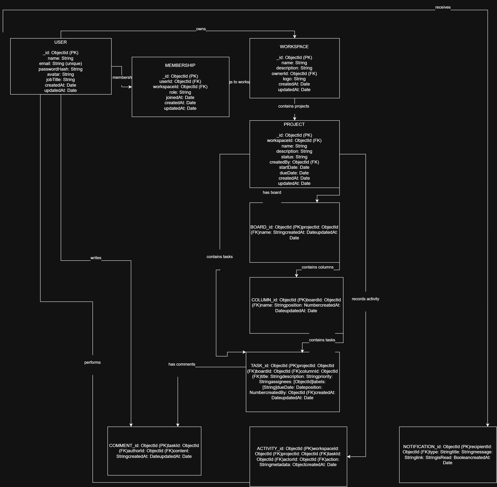

<div align="center">

# ◈ TASKMATRIX

### Enterprise Agile Project Management Platform

**Plan · Organize · Execute · Deliver**

A modern full-stack project management platform designed to help teams manage projects, tasks, collaboration, and productivity from one centralized workspace.

<br>


<br>

**Prodesk IT · Summer Engineering Internship 2026 · Capstone Project**

**Designated Track: Backend Architecture**

</div>

---

# 🌐 LIVE APPLICATION

<div align="center">

## ◈ TASKMATRIX IS LIVE

<br>

<a href="YOUR_LIVE_URL">


</a>

<br><br>

**[ ENTER TASKMATRIX → ](https://prodesk-capstone-task-matrix-one.vercel.app/login)**

</div>

---

# 01 — PROJECT INFORMATION

| Item | Details |
|---|---|
| **Project Name** | TaskMatrix |
| **Project Type** | Enterprise Agile Project Management Platform |
| **Internship** | Prodesk IT Summer Engineering Internship 2026 |
| **Phase** | Capstone |
| **Designated Track** | Backend Architecture |
| **Development Model** | Full-Stack Application |
| **Database** | MongoDB Atlas |
| **UI/UX Tool** | Figma |
| **Architecture Tool** | Draw.io |

---

# 02 — PRODUCT OVERVIEW

TaskMatrix is an Agile Project Management platform designed for modern software teams.

It provides a centralized workspace where teams can:

- Create and manage workspaces
- Create and manage projects
- Create and assign tasks
- Organize work through Kanban boards
- Collaborate with team members
- Track project progress
- Monitor productivity
- Manage deadlines and notifications

The project is being developed as the **Prodesk IT Summer Engineering Internship 2026 Capstone Project**.

---

# 03 — PROBLEM STATEMENT

Development teams often rely on multiple disconnected tools for project planning, task tracking, collaboration, and progress monitoring.

This can lead to:

- Scattered project information
- Poor task visibility
- Difficult team coordination
- Missed deadlines
- Inefficient workflows
- Limited project insights

### TaskMatrix Approach

```text
Centralized Workspace
        ↓
Project Management
        ↓
Task Management
        ↓
Kanban Workflow
        ↓
Team Collaboration
        ↓
Progress & Analytics
```

---

# 04 — PRODUCT OBJECTIVES

The primary objectives of TaskMatrix are:

- Build a production-oriented project management platform.
- Provide secure authentication and authorization.
- Implement scalable backend architecture.
- Provide project and task management.
- Implement Kanban-based workflows.
- Support team collaboration.
- Provide project progress insights.
- Maintain a modular and maintainable codebase.
- Create a responsive and professional user experience.

---

# 05 — PRIORITIZED CORE FEATURES

## 🔴 P0 — Mandatory MVP

| Priority | Feature | Description |
|---|---|---|
| P0 | 🔐 Authentication | Registration, login, logout and session management |
| P0 | 🏢 Workspaces | Create and manage team workspaces |
| P0 | 📁 Projects | Create, view, update and delete projects |
| P0 | ✅ Tasks | Create, assign, update and delete tasks |
| P0 | 📋 Kanban Board | Visual task workflow management |
| P0 | 👥 Team Management | Manage workspace members and roles |
| P0 | 📊 Dashboard | Project and task overview |

---

## 🟡 P1 — Priority Features

| Priority | Feature | Description |
|---|---|---|
| P1 | 💬 Comments | Task-level collaboration |
| P1 | 🔔 Notifications | Task and project updates |
| P1 | 📅 Calendar | Deadlines and scheduled activities |
| P1 | 🔎 Search | Search projects and tasks |
| P1 | 🎯 Filters | Filter and sort project/task data |
| P1 | 📈 Reports | Project and productivity analytics |
| P1 | ⚙️ Settings | Account and workspace configuration |

---

## 🔵 P2 — Stretch Goals

| Priority | Feature | Description |
|---|---|---|
| P2 | ⚡ Real-Time Updates | Live project and task updates |
| P2 | 🤖 AI Assistance | AI-powered task/project assistance |
| P2 | 📧 Email Notifications | Automated communication |
| P2 | 📎 File Attachments | Task and project files |
| P2 | 📊 Advanced Analytics | Detailed productivity insights |
| P2 | 🔗 Integrations | External service integrations |

---

# 06 — TECHNOLOGY STACK

## Frontend

| Technology | Purpose |
|---|---|
| React 19 | User interface |
| TypeScript | Type-safe development |
| Vite | Development and build tooling |
| Tailwind CSS | Styling |
| React Router | Application routing |
| Zustand | Global state management |
| React Hook Form | Form handling |
| Zod | Validation |
| Axios | API communication |
| DND Kit | Kanban drag-and-drop |
| Recharts | Analytics |
| Framer Motion | UI animations |
| Lucide React | Icons |

## Backend

| Technology | Purpose |
|---|---|
| Node.js | Runtime |
| Express.js | REST API |
| MongoDB Atlas | Database |
| Mongoose | Database modeling |
| bcrypt | Password hashing |
| HTTP-only Cookies | Authentication |

## Tools

| Tool | Purpose |
|---|---|
| Git & GitHub | Version control |
| Figma | UI/UX design |
| Draw.io | Architecture diagrams |
| Postman / Thunder Client | API testing |
| Vercel | Deployment |

---

# 07 — UI/UX DESIGN

The TaskMatrix interface was designed before implementation as part of the Sprint 13 planning phase.

### Core Viewports

The design includes the required core views:

1. **Authentication Screen**
2. **Main Dashboard**
3. **Data / Task Details View**

Additional views include:

- Projects
- Kanban Board
- Calendar
- Team Management
- Reports
- Notifications
- Profile
- Settings

### Design Principles

- Modern SaaS interface
- Clear visual hierarchy
- Consistent spacing
- Reusable components
- Responsive layouts
- Accessible interactions
- Consistent design language

### 🎨 Figma Design

**[View the TaskMatrix Figma Design →](https://www.figma.com/design/00t4wXLsmsmPlbyLx1gUBV/TaskMatrix-UI?node-id=0-1&t=jkT3RZP0HjexgJBo-1)**

---

# 08 — SYSTEM ARCHITECTURE

TaskMatrix follows a layered architecture separating the UI, state management, business logic, data access, and API communication.

```text
┌─────────────────────────┐
│        React UI         │
│ Pages + Components      │
└────────────┬────────────┘
             ↓
┌─────────────────────────┐
│      Zustand Store      │
└────────────┬────────────┘
             ↓
┌─────────────────────────┐
│      Service Layer      │
└────────────┬────────────┘
             ↓
┌─────────────────────────┐
│    Repository Layer     │
└────────────┬────────────┘
             ↓
┌─────────────────────────┐
│      Axios Client       │
└────────────┬────────────┘
             ↓
┌─────────────────────────┐
│     Express REST API    │
└────────────┬────────────┘
             ↓
┌─────────────────────────┐
│      MongoDB Atlas      │
└─────────────────────────┘
```

---

# 09 — DATABASE ARCHITECTURE

TaskMatrix uses MongoDB Atlas for persistent application data.

### Planned Collections

```text
Users
Workspaces
WorkspaceMembers
Projects
Tasks
Comments
Notifications
Activities
```

### Relationship Overview

```text
User
 │
 └── Workspace
       │
       ├── Members
       │
       └── Projects
              │
              └── Tasks
                    ├── Comments
                    └── Activities
```

<div align="center">

<table>
<tr>
<td align="center" width="50%">

### ER Diagram



</td>

<td align="center" width="50%">

### 


</td>
</tr>
</table>

</div>

---

# 10 — FRONTEND STATE ARCHITECTURE

TaskMatrix uses Zustand for global frontend state.

```text
TaskMatrix Store
│
├── Auth Store
│   ├── User
│   ├── Authentication
│   └── Session
│
├── Workspace Store
│   ├── Workspaces
│   ├── Active Workspace
│   └── Members
│
├── Project Store
│   ├── Projects
│   ├── Selected Project
│   └── Filters
│
├── Task Store
│   ├── Tasks
│   ├── Selected Task
│   ├── Kanban State
│   └── Filters
│
├── Notification Store
│   └── Notifications
│
└── Theme Store
    └── Theme
```

### State Flow

```text
Component
    ↓
Zustand
    ↓
Service
    ↓
Repository
    ↓
API Client
```

### State Tree Diagram

> 📌 **Add the exported State Tree diagram here.**

**File:** `docs/diagrams/state-tree.png`

---

# 11 — API ENDPOINT PLAN

The frontend communicates with the backend through a centralized API layer.

## Authentication

| Method | Endpoint | Purpose |
|---|---|---|
| POST | `/api/auth/register` | Register user |
| POST | `/api/auth/login` | Login |
| POST | `/api/auth/logout` | Logout |
| GET | `/api/auth/me` | Current user |

## Workspaces

| Method | Endpoint | Purpose |
|---|---|---|
| GET | `/api/workspaces` | List workspaces |
| POST | `/api/workspaces` | Create workspace |
| GET | `/api/workspaces/:id` | Workspace details |
| PATCH | `/api/workspaces/:id` | Update workspace |
| DELETE | `/api/workspaces/:id` | Delete workspace |

## Projects

| Method | Endpoint | Purpose |
|---|---|---|
| GET | `/api/projects` | List projects |
| POST | `/api/projects` | Create project |
| GET | `/api/projects/:id` | Project details |
| PATCH | `/api/projects/:id` | Update project |
| DELETE | `/api/projects/:id` | Delete project |

## Tasks

| Method | Endpoint | Purpose |
|---|---|---|
| GET | `/api/tasks` | List tasks |
| POST | `/api/tasks` | Create task |
| GET | `/api/tasks/:id` | Task details |
| PATCH | `/api/tasks/:id` | Update task |
| DELETE | `/api/tasks/:id` | Delete task |
| PATCH | `/api/tasks/:id/status` | Update task status |

---

# 12 — AUTHENTICATION & SECURITY

TaskMatrix is designed around secure HTTP-only cookie authentication.

```text
User
 ↓
Login
 ↓
Backend Authentication
 ↓
HTTP-only Cookie
 ↓
Authenticated Request
 ↓
Protected API
```

### Security Principles

- HTTP-only authentication cookies
- Password hashing
- Protected API routes
- Authorization checks
- Input validation
- Centralized error handling
- No passwords stored in frontend storage
- No JWT stored in localStorage
- Sensitive backend information is not exposed

---

# 13 — KANBAN WORKFLOW

The primary task workflow consists of:

```text
┌─────────┐
│  TODO   │
└────┬────┘
     ↓
┌─────────────┐
│ IN PROGRESS │
└──────┬──────┘
       ↓
┌─────────┐
│ REVIEW  │
└────┬────┘
     ↓
┌─────────┐
│  DONE   │
└─────────┘
```

Tasks support:

- Priority
- Assignee
- Due date
- Labels
- Checklist
- Comments
- Activity history

---

# 14 — PROJECT STRUCTURE

```text
prodesk-capstone-taskmatrix/
│
├── client/
│   └── src/
│       ├── components/
│       ├── pages/
│       ├── hooks/
│       ├── services/
│       ├── repositories/
│       ├── store/
│       ├── routes/
│       ├── types/
│       └── utils/
│
├── server/
│   ├── config/
│   ├── controllers/
│   ├── middleware/
│   ├── models/
│   ├── routes/
│   ├── services/
│   └── validators/
│
├── docs/
│   ├── diagrams/
│   └── images/
│
├── README.md
└── LICENSE
```

---

# 15 — SPRINT 13 DELIVERABLES

This README follows the Sprint 13 specification.

| Requirement | Status |
|---|---|
| Project Selection | ✅ TaskMatrix |
| Public GitHub Repository | ✅ |
| Product Requirements Document | ✅ |
| Project Name | ✅ |
| Designated Track | ✅ Backend Architecture |
| Technology Stack | ✅ |
| Prioritized Core Features | ✅ |
| UI/UX Wireframes | ✅ |
| Minimum 3 Core Viewports | ✅ |
| Public Figma Link | 🔗 Add Link |
| ER Diagram | 📌 Add Diagram |
| MongoDB Relationships | 📌 Add Diagram |
| State Tree Diagram | 📌 Add Diagram |
| Mock API Endpoints | ✅ |
| Live Website | 🔗 Add Link |
| 2–3 Minute Video | 🎥 Add Link |

---

# 16 — DEVELOPMENT ROADMAP

```text
SPRINT 13
│
├── Product Planning
├── PRD / README
├── Figma UI/UX
├── System Architecture
├── ER Diagram
└── State Tree
        │
        ▼
SPRINT 14
│
├── Authentication
├── Workspaces
└── Backend Integration
        │
        ▼
SPRINT 15
│
├── Projects
├── Tasks
├── Kanban
└── Team Management
        │
        ▼
SPRINT 16
│
├── Collaboration
├── Notifications
├── Analytics
├── Testing
└── Deployment
```

---

# 17 — FINAL SUBMISSION

| Deliverable | Link |
|---|---|
| 📂 GitHub Repository | `YOUR_GITHUB_URL` |
| 🌐 Live Website | `YOUR_LIVE_URL` |
| 🎨 Figma File | `YOUR_FIGMA_URL` |
| 🎥 Demo Video | `YOUR_YOUTUBE_URL` |

---

# 18 — DEMO VIDEO

The 2–3 minute demonstration will cover:

```text
Project Introduction
        ↓
Problem & Solution
        ↓
Figma UI/UX
        ↓
System Architecture
        ↓
ER Diagram
        ↓
State Tree
        ↓
Working Prototype
        ↓
Development Roadmap
```

🎥 **[Watch the TaskMatrix Demo →](YOUR_YOUTUBE_URL)**

---

# 👨‍💻 AUTHOR

<div align="center">

## Daksh Choudhary

**B.Tech — Artificial Intelligence & Machine Learning**

Haridwar University

**Prodesk IT Summer Engineering Internship 2026**

**Backend Architecture Track**

[GitHub](YOUR_GITHUB_PROFILE) · [LinkedIn](YOUR_LINKEDIN_PROFILE)

</div>

---

<div align="center">

### ◈ TASKMATRIX

**Plan · Organize · Execute · Deliver**

Built as a Prodesk IT Capstone Project.

</div>
